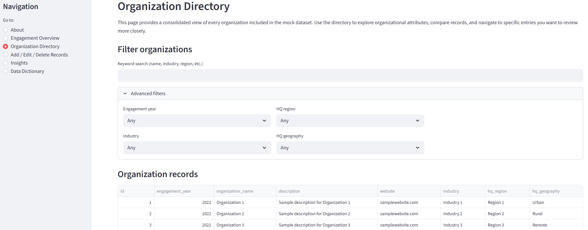
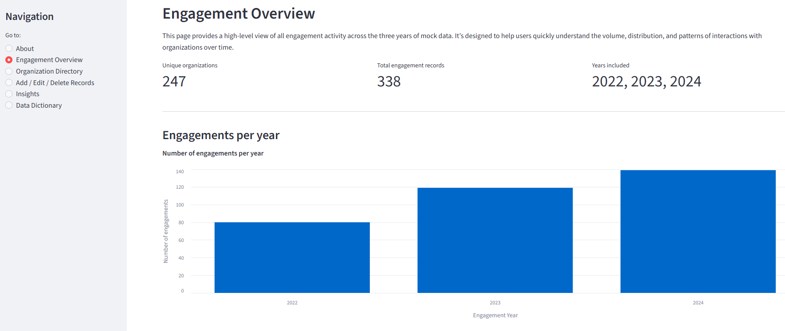
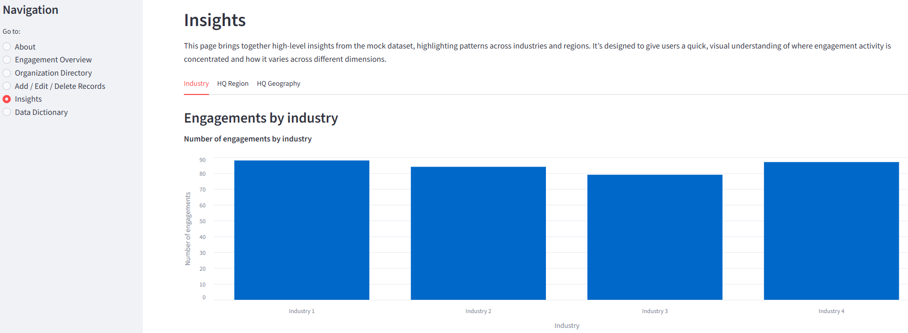

# Engagement Analytics Platform Built with Python, SQLite, and Streamlit
##### Author: [Lisa Monozlai](https://www.linkedin.com/in/lisamonozlai/)
---

### ▶ **[View Database Demo](https://lisamonozlai-interactive-database-demo.streamlit.app/)**

Browse, filter, update, and visualize multi‑year data through a structured interface that protects the integrity of the original source files.

---

## Demo Preview

### Directory View
A structured table showing all engagement records across years.

### Overview Dashboard
A high‑level summary of engagement activity with filters and clean UI components.

### Insights & Visualizations
Charts and aggregated metrics that highlight multi‑year engagement patterns.

---

## About

This project demonstrates how organizations can transition from fragmented spreadsheets to a structured, queryable relational database system.

Many small and mid-sized teams rely on multi-year Excel files to track engagement data. While familiar, this approach limits visibility, consistency, and analytical insight. This project illustrates what becomes possible when engagement data is unified in a relational database and exposed through an interactive application.

All data in this project is fictional and designed to demonstrate:

- How relational storage improves data integrity and consistency  
- How controlled vocabularies reduce ambiguity across years  
- How structured schemas enable reliable filtering and aggregation  
- How a simple UI makes structured data accessible to non-technical users  
- How multi-year engagement patterns emerge once data is unified  

---

## Challenge

To ground the project, this system models a hypothetical team that wants to understand which organizations they engage with each year. Their data lives in three separate spreadsheets:

- `engagement_data_2022.xlsx`  
- `engagement_data_2023.xlsx`  
- `engagement_data_2024.xlsx`  

Although the files share similar fields, the team cannot easily:

- View all years together  
- Filter by industry, region, or organization size  
- Compare engagement patterns across years  
- Update records without manually editing spreadsheets  
- Maintain consistent vocabularies across files  

They need a solution that is low cost, low maintenance, and compatible with familiar workflows.

---

## Solution Overview

This project implements a lightweight engagement analytics platform built with:

- **Python** for cleaning, merging, and standardizing multi-year data  
- **SQLite** for relational storage  
- **SQL** for structured queries and aggregation  
- **Streamlit** for a non-technical, interactive frontend  

The architectural pattern separates data processing, database logic, and UI rendering to ensure maintainability and clarity.

---

## How the System Works

This project is organized into a few clear parts that work together to turn raw spreadsheets into an interactive dashboard:

- **Raw data** (`data/raw/`)  
  The original Excel files for 2022–2024. These are never edited directly.

- **Processing and storage** (`scripts/`, `data/processed/`, `db/`)  
  A small script loads the spreadsheets, standardizes fields, applies consistent vocabularies, and saves everything into a lightweight SQLite database (`engagement.db`).  
  The `db` folder contains the database schema and the small set of queries the app uses to search, filter, and update records.

- **Application interface** (`app.py` and `ui/`)  
  Streamlit powers the user-facing dashboard. The `ui` folder defines the layout, reusable components, and visual styling that make the data easy to browse, filter, edit, and visualize.

- **Utilities** (`utils/`)  
  Small helper functions and caching utilities keep the app fast, clean, and maintainable.

Together, these pieces create a simple pipeline:  
**spreadsheets → cleaned database → interactive dashboard**.

---

## Analytical Capabilities

Once unified in a relational database, the data supports operational and strategic questions such as:

- Which industries do we engage with most frequently?  
- How does engagement vary by region or geography?  
- Are we reaching organizations of different sizes?  
- Which organizations appear across multiple years?  

These insights are difficult to generate reliably when data is siloed across spreadsheets.

---

## Results

With this system, users can:

- Browse all engagement records across 2022–2024  
- Filter and search across structured fields  
- Add, edit, and delete records through validated forms  
- Visualize engagement patterns via charts  
- Reference a clear and documented data dictionary  

The result is a lightweight internal analytics tool that replaces fragmented spreadsheets with a maintainable relational architecture.

---

## Considerations and Constraints

This project is designed as a lightweight internal tool and technical demonstration.

- SQLite is well-suited for small datasets and single-user workflows but not concurrent editing  
- Streamlit is ideal for prototypes and internal tools but does not include built-in authentication  
- Generative AI should not be used with sensitive organizational data  

---

## Scaling the Architecture

A production-ready implementation could substitute:

- PostgreSQL or MySQL for multi-user database needs  
- FastAPI or a similar backend framework for API-based architecture  
- Authentication and role-based permissions  
- Cloud hosting with appropriate security controls  
- Low-code alternatives (e.g., SharePoint + Power Apps or Google AppSheet) for non-technical teams  

The core architectural pattern — ETL + relational schema + controlled vocabularies + UI layer — remains the same. Only the tooling changes.

---

## License

[MIT](https://opensource.org/license/mit)
